# MEV Shanghai

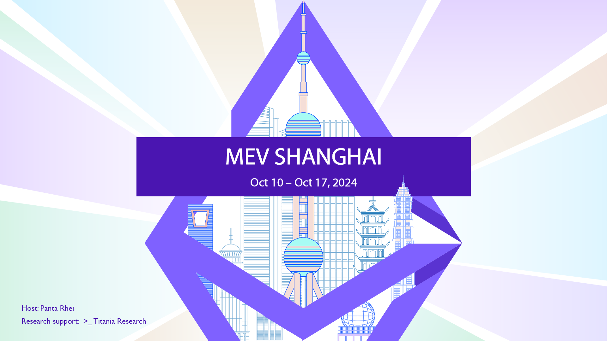

# About 🔖

- MEV Shanghai is a MEV-focused event that combines a 7-day Research House with 2 days of side events during the [Shanghai International Blockchain Week](https://x.com/WXblockchain/status/1802607014595674207).
- The side events will be hosted **on October 15th and 16th**, with the theme “MEV Supply Chain” and “MEV Re-distribution”.
- The house will run from **October 10th to 17th.**
- MEV Shanghai is a forked MEV-themed event inspired by [MEV Tokyo](https://github.com/titania-research-labs/mev-tokyo/tree/main?tab=readme-ov-file). We’re honored to have [Titania Research](https://titaniaresear.ch/) join us as our research support for this event.

# Theme - what do we care about? 🤔

We are focusing on the centralization concerns under Ethereum PoS design and how to mitigate them. That is to explore some open problems around these topics and discuss potential solutions to toxic MEV and centralized staking.

We may look into approach focused on trustless, decentralized roles in the supply chain: searcher, builder, relayer, proposer, and validator. For example, ePBS separates builder and proposer at the protocol level, removing the need for trust in relayers. And its variants like Slot-auction ePBS, Execution Auctions and Execution Tickets further decouple builder and proposer, capturing MEV at the protocol level. Solving centralized concerns in validator staking through Rainbow Staking, decentralizing proposer through MCP…

We may also look into approach aimed to prevent toxic MEV by using batch auctions on the application-layer and providing private transaction RPC on the supply chain...

Lastly, MEV value redistribution strategies include MEV share, order flow auction, and OEV capture, enabling users and applications to capture MEV, while MEV Burn allows MEV to be captured at the protocol level.

# Programs ✅

In general, we will have some in-house talk sessions, discussions, and collaborative research during the Research House. We’re also going to organize a 2-day side event open to the public.

## Research House (Oct 10th - 17th) 🏠︎

- The Research House aims to nature a space for protocol researchers, engineers, developers, and builders from mev ecosystem to have some deeper discussions and exchanges dedicated to advance potential collaborative research in the future.
- Location: Pudong, Shanghai
- Recruitment: 15 - 20 people

## Side Event - MEV Shanghai (Oct 15th - 16th) 🧠

- MEV Shanghai aims to bring together experts and enthusiasts in the field and helps people better connect to foster collaboration in addressing open problems related to MEV and staking issues.
- Venue: YETEA, Shuangshi Hui L1 - 10, Dongchangzhi Road No.399 (International Cruise Terminal Subway Station Entrance & Exit 4), Hongkou, Shanghai, China

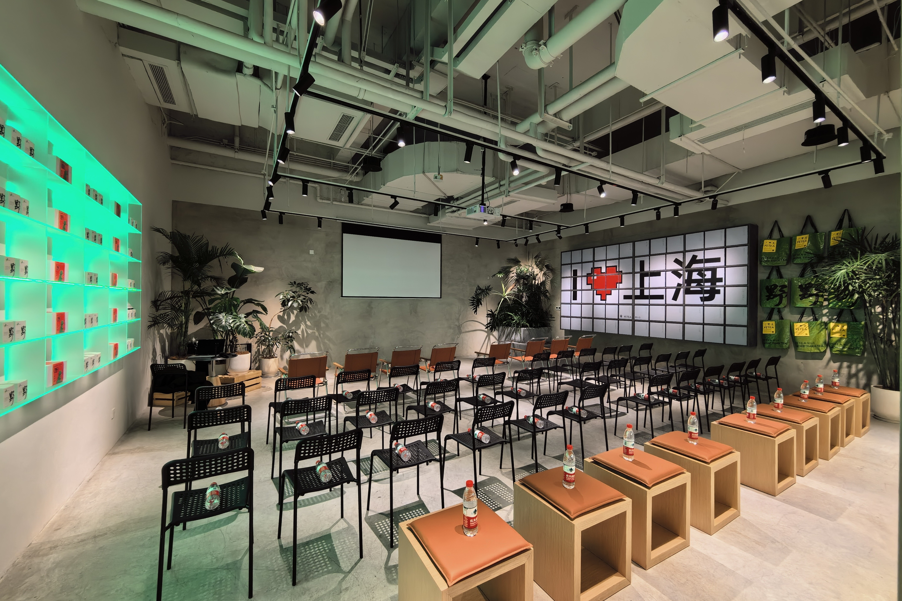

### Oct 15th: MEV Supply Chain DAY

- Content related to MEV Supply Chain such as
  - Removing relayer and decoupling builder and proposer: ePBS and its variants like Slot-auction ePBS, Execution Auctions and Execution Tickets, …
  - Decentralizing validator: rainbow staking, EIP-7716, …
  - Decentralizing proposer: MCP, …
- Speakers
  - [BlockSec](https://x.com/BlockSecTeam)
  - TBA

### Oct 16th: MEV Re-distribution DAY

- Content related to MEV Re-distribution, such as

  - User/application capture: mev share, order flow auction and oev capture, …

  - LP capture: cf-amm, …

  - Protocol capture: mev burn, ….

- Speakers
  - TBA

# Sponsorship 💰

We are seeking sponsors to support MEV Shanghai, with two sponsorship tiers available:

- **Supporter Sponsor – $1,500 USD**
    - **Branding Benefits**: Logo on event website and social media, swag/flyer distribution, onsite booth.
    - **Event Benefits**: 15-minute lightning talk.
    - **House Benefits**: Slot at the house apartment, stay at the House until bedtime.

- **Beacon Sponsor – $2,500 USD**
    - **Branding Benefits**: Logo on event website and social media, swag/flyer distribution, onsite booth.
    - **Event Benefits**: 30-minute keynote.
    - **House Benefits**: Full stay at the House.

# Application Form 📝

If you would like to apply as a housemate, event speaker, sponsor, or audience, please fill out the form and wait for us to get in touch.

https://tally.so/r/3NYY2B

# Contributors ⚡️

### Host

MEV Shanghai is hosted by [Panta Rhei](https://www.notion.so/Panta-Rhei-Homepage-880ec73dc0d343639bf0a5a7e1d2ab41?pvs=21), which is a research-driven, open-source community, focusing on advancing the study of Ethereum economics.

### Research Support

Many thanks to [Titania Research](https://titaniaresear.ch/) for providing us with valuable suggestions on MEV Shanghai.

Titania Research is a research organization that works on research and development on the problems of MEV in Ethereum. They aim to create solutions and contribute to Ethereum, rather than focusing solely on research. This includes research and development in software, supply chain and security, primarily based on findings in mechanism design, computer science and cryptography.

# Past Activities 👏

## EIP-4844 Economics session and workshop series

We hosted an in-person [EIP-4844 Economics session and workshop series](https://x.com/0xpantarhei/status/1787523344239403406) with FDU-VIS at Fudan University.

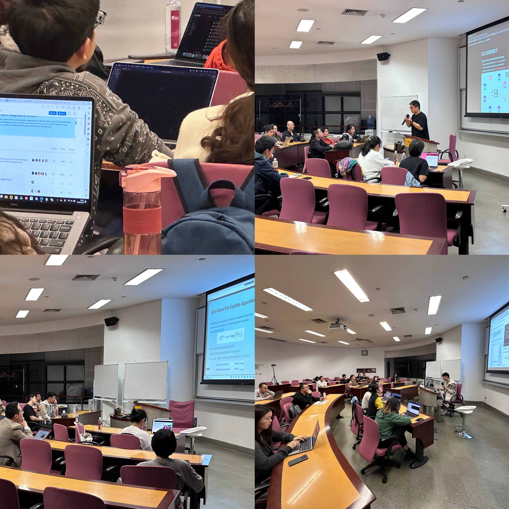

## Shenzhen Research House

[Shenzhen Research House](https://www.notion.so/Shenzhen-Researcher-House-ZKRollup-Economics-5a8cc68a38c64de1afe7ce07f52415d8?pvs=21), centered on the theme of ZKRollup Economics, was held from August 14th to 18th. We also hosted a researchathon during the House.

This Research House was sponsored by EF [Ecosystem Support Program](https://x.com/EF_ESP). See the full [recap](https://x.com/Franci_Deng/status/1829188872217174143) here.

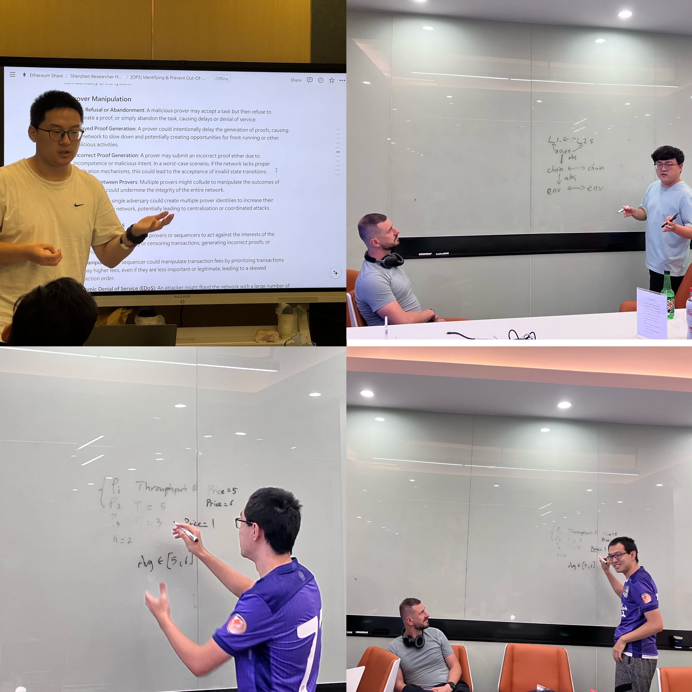

# Contact ☎️

Reach out to [Franci](https://t.me/FrancixDeng) if you have any questions about MEV Shanghai.

# House Pictures 🏡

The house has four private rooms and can accommodate up to 8 people. This means we’ll need to arrange accommodation for other housemates in nearby apartments. However, every housemate is welcome to stay at the house until bedtime for closer discussions.

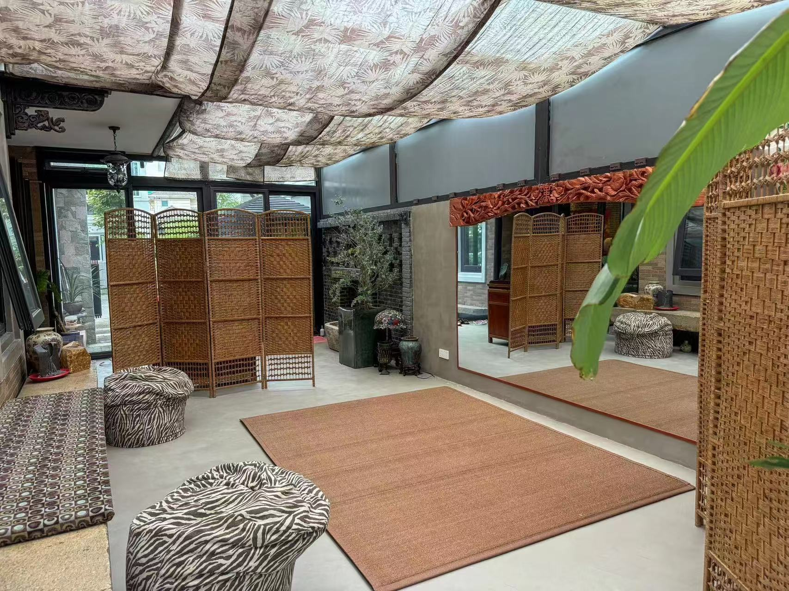
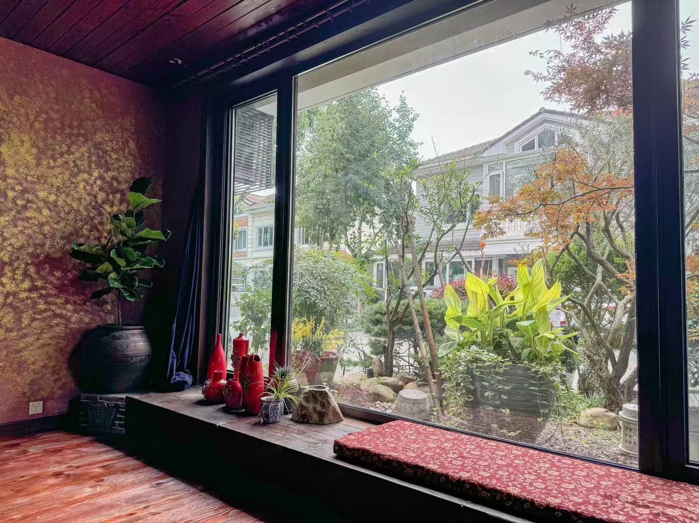
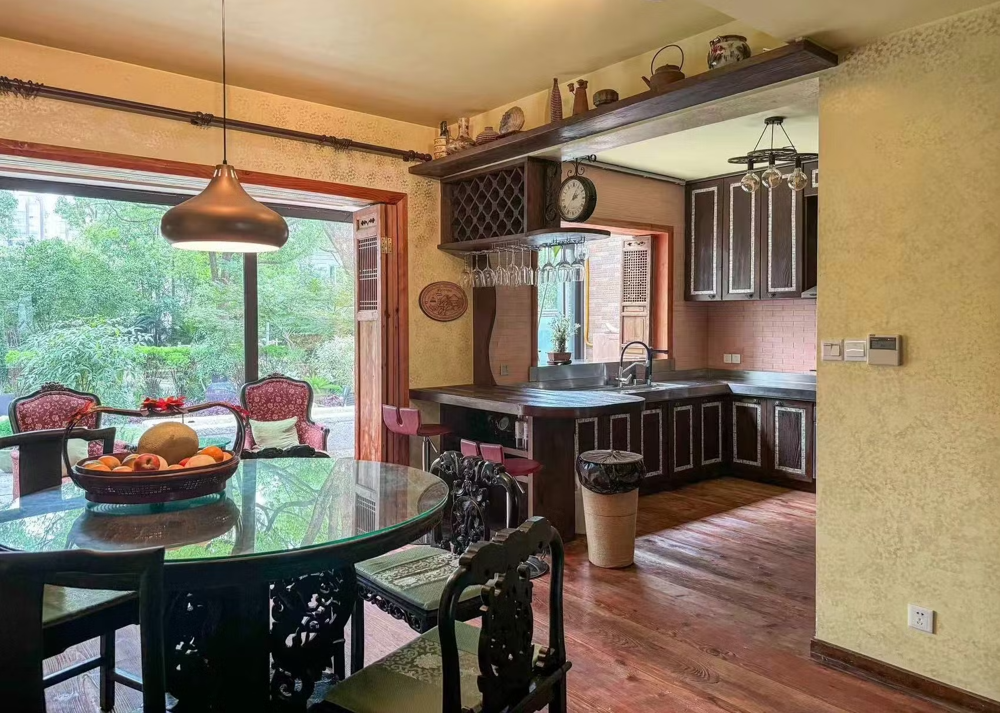
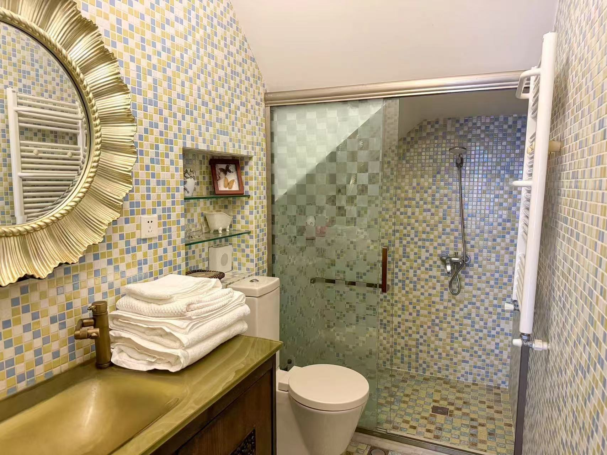
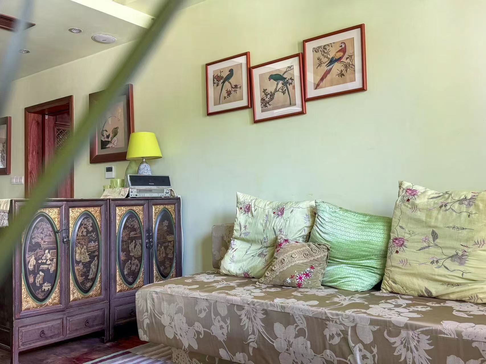
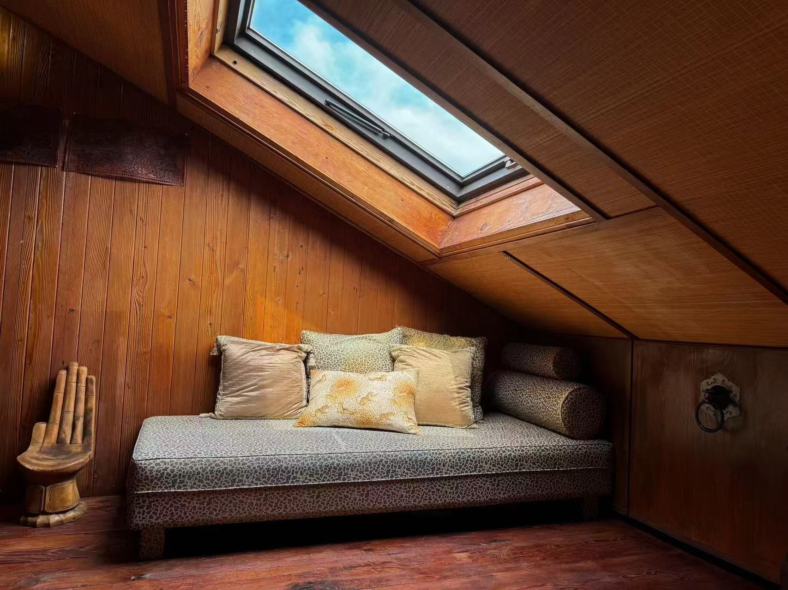

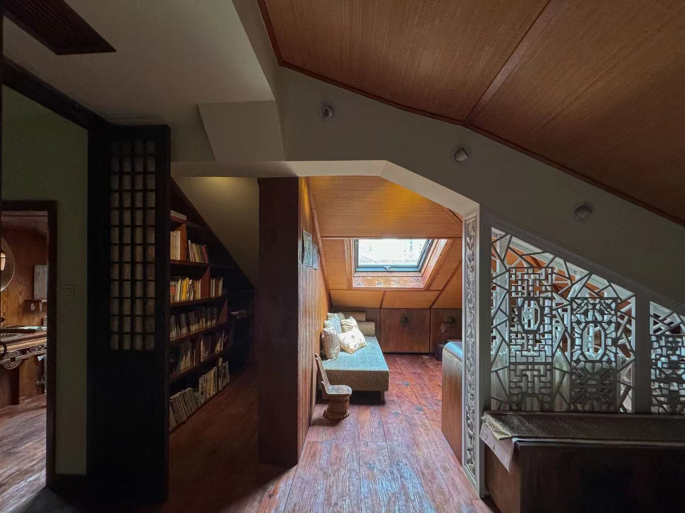
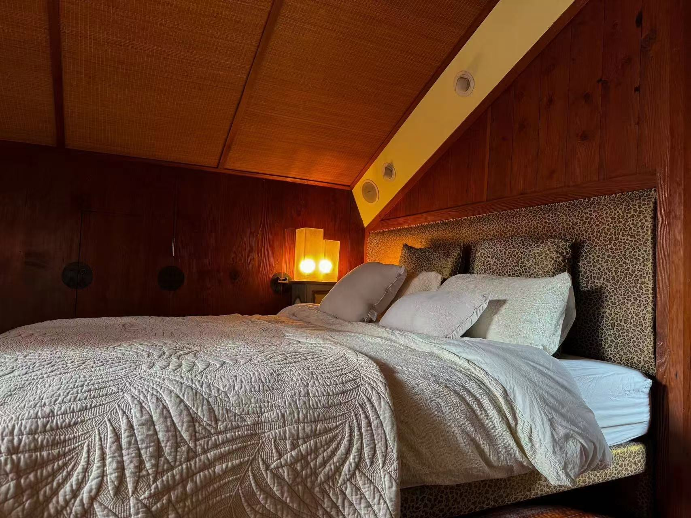
